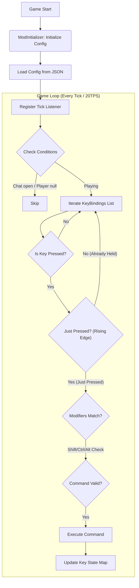
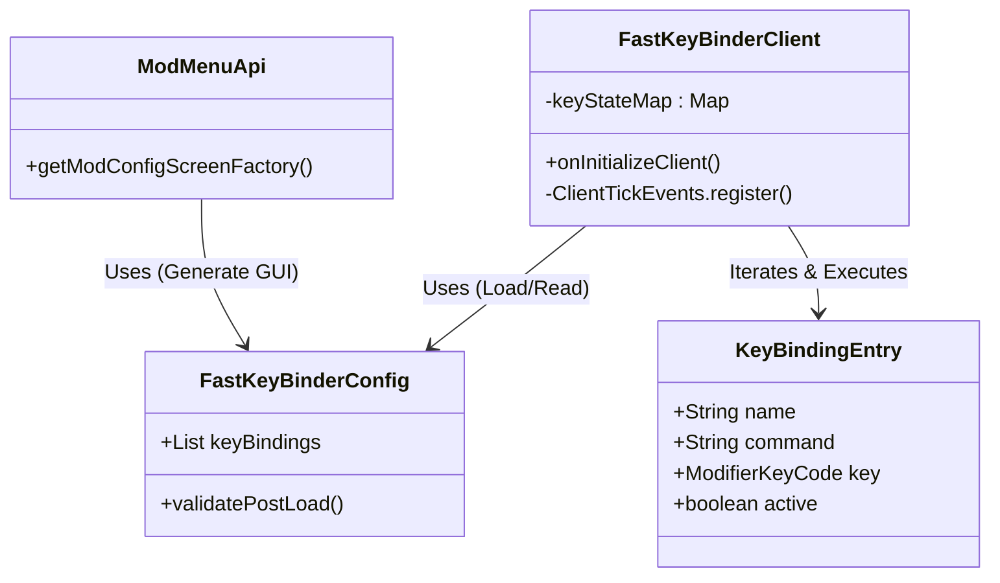

# DMM Fast Key Binder
  

> **[Korean Manual (한국어 설명서)](./README_KR.md)**

## Description
**DMM Fast Key Binder** is a lightweight client-side utility mod for Minecraft 1.21.4 (Fabric).  
It allows users to map complex commands (e.g., /gamemode creative, /time set day) to specific key combinations (e.g., Shift + F6) for instant execution.

Designed for users who frequently use commands on third-party servers or single-player worlds, it offers a clean GUI to manage your macros without editing configuration files manually.

---

### Key Features
- **Unlimited Custom Bindings**: Register and manage as many command macros as you need.
- **Modifier Key Support**: Supports complex combinations like Shift + R or Ctrl + Alt + T to avoid conflicts.
- **Intuitive GUI**: Easily manage settings in-game via Mod Menu and Cloth Config.
- **Anti-Spam Logic**: Uses "Rising Edge" detection to execute commands only once per key press, even if held down.
- **Smart Input Correction**: Automatically handles commands with or without the leading /.

---

### System Architecture

View Logic Flow & Class Diagrams (Click to expand)

#### 1. Logic Flowchart
Similar to a Spring Scheduler, it listens for inputs every tick (0.05s).

#### 2. Class Diagram

---

### Developer Guide

This mod is designed with a structure familiar to backend developers.

| Mod Term (Fabric) | Spring/Web Equivalent | Description |
| :--- | :--- | :--- |
| **ClientModInitializer** | @PostConstruct | Entry point executed once on client startup. |
| **ConfigData** | @Entity / DTO | Data object mapped to the JSON config file (ORM-like). |
| **ClientTickEvent** | @Scheduled | Hook into the main game loop, executed every tick. |
| **ModifierKeyCode** | Composite Key | Value Object (VO) managing Key Code + Modifiers. |

---

### Build & Installation

1. **Build**
   - Run ./gradlew build in your terminal (or use the Gradle tab in IntelliJ).

2. **Locate File**
   - Find the .jar file in build/libs/.
   - *Note: Do not use files ending in -sources.jar or -dev.jar.*

3. **Install**
   - Copy the .jar file into your Minecraft mods folder.

4. **Dependencies**
   - <strong style="color:tomato">The following mods are required for this mod to work:</strong>
     - [Fabric API](https://modrinth.com/mod/fabric-api) [1.21.4] Fabric API 0.119.4+1.21.4
     - [Cloth Config API](https://modrinth.com/mod/cloth-config) [Fabric 1.21.4] v17.0.142
     - [Mod Menu](https://modrinth.com/mod/modmenu) v13.0.2 for 1.21.4

### Deployment Roadmap

- Implementation of an automated script for downloading mods and dependencies.
