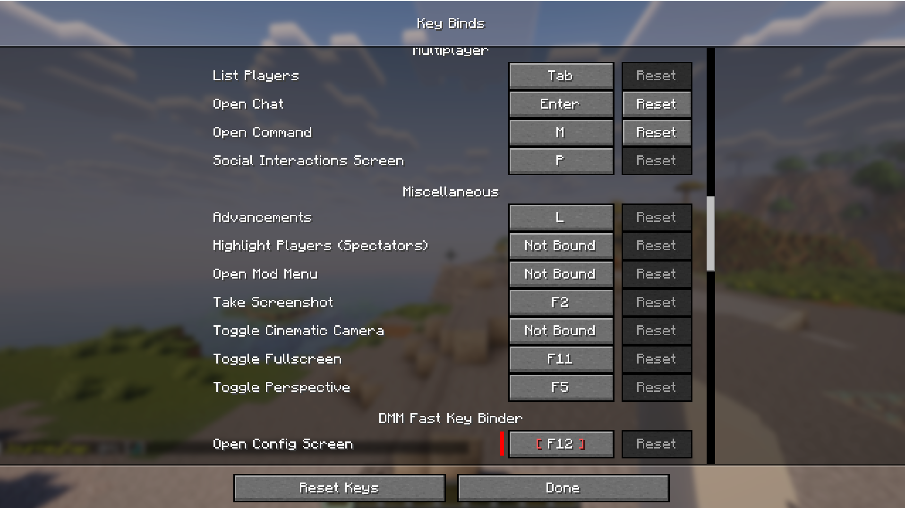
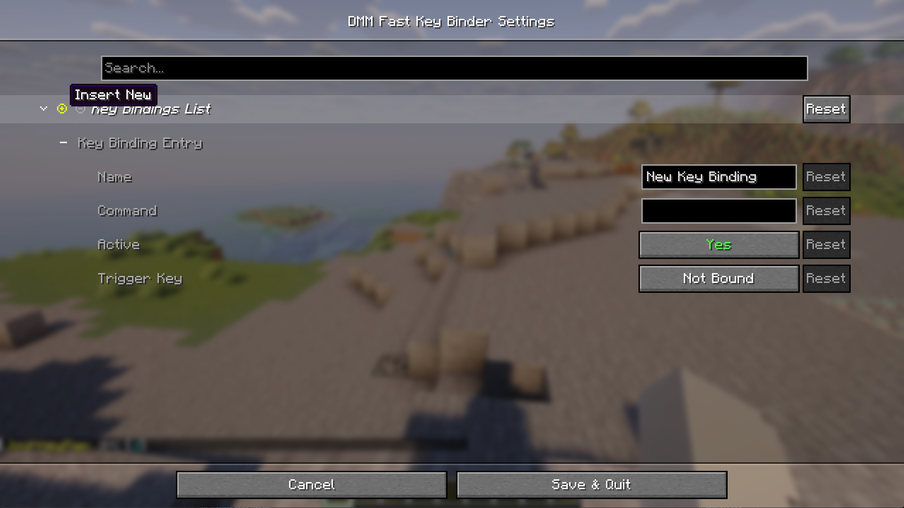
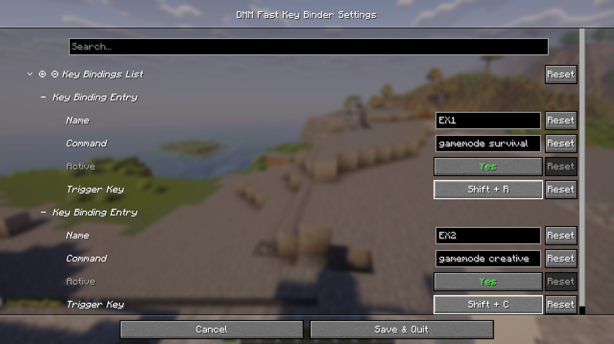
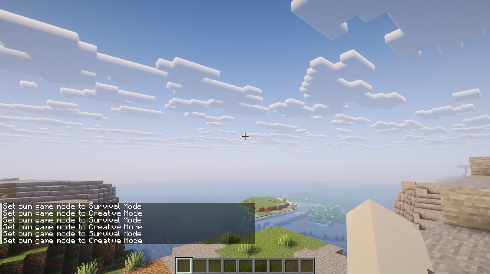
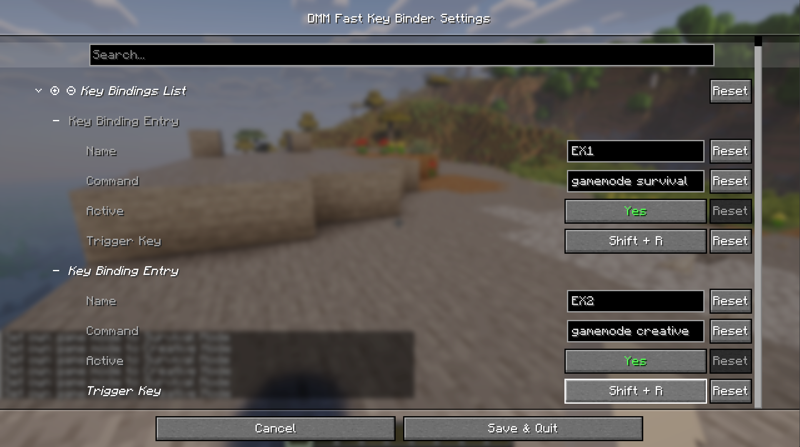
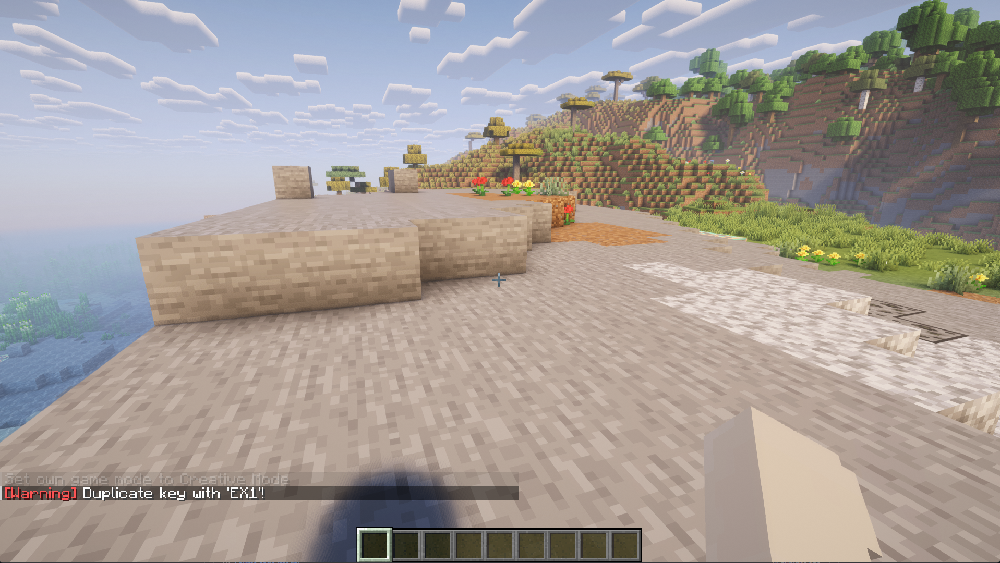
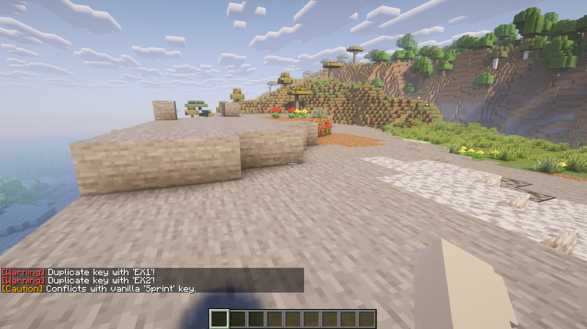

# DMM Fast Key Binder
  

> **[🇰🇷 한국어 설명서 보기 (Korean Manual)](./README_KR.md)**

## Description
**DMM Fast Key Binder** is a lightweight command-binding utility for Minecraft client environments (Fabric 1.21.4).
It provides the functionality to map complex commands (e.g., `/gamemode creative`, `/time set day`) to specific keys (including combination keys) for instant execution.

It eliminates the hassle of opening the chat window and typing commands in third-party open servers or single-player environments, allowing you to easily manage macros through an **intuitive GUI**.

---

### Key Features
- **Unlimited Custom Bindings**: Register and manage an unlimited number of command macros with custom names.
- **Modifier Key Support (Modifiers)**: Supports various combination keys like Shift + F, Ctrl + Alt + R, ensuring no conflicts with existing keys.
- **Convenient GUI**: Change settings intuitively in-game using Mod Menu and Cloth Config.
- **Spam Prevention (Rising Edge)**: Designed so that commands are executed only once even if the key is held down.
- **Smart Input Correction**: Automatically recognizes and executes commands correctly whether you include the leading `/` or not.

---

<strong>How to Use (Images) - Click to expand</strong>

#### Set Config Shortcut

> In Minecraft's Key Binds settings, you can assign a shortcut to open the mod's dedicated configuration screen.

  

#### Add Binding

> Use the 'Add New' button to reveal the configuration area for new bindings in the list below.

  

#### Register Binding

> Assign a name, enter the command, and click the key button to set your trigger key.  
> **Shift, Alt, and Ctrl** combination keys are supported.

  

#### Usage

> Press the bound key to instantly execute your command.

  

#### Duplicate Prevention

> If you try to save a duplicate key binding, a **warning notification** will appear as shown above.  
> The key is still saved, so please check and manage your duplicate bindings carefully.

  

#### Vanilla Key Conflict

> If your key conflicts with a vanilla Minecraft key binding, the mod will inform you exactly which key it conflicts with.

**Enjoy Minecraft!**

---

### Build & Installation
- If you only downloaded the JAR file from Releases, please place it in the `.minecraft/mods` folder along with the required dependencies listed in step 4.
- Must be applied in a Fabric environment.

1. **Build**
   - Run `./gradlew build` in your terminal (or execute the `build` task in the IntelliJ Gradle tab).
   
2. **Verify File**
   - Check the `DMM_FastKeyBinder-xxx.jar` file in the `build/libs/` folder.
   - *Note: Files ending in `sources` or `dev` are not for distribution.*

3. **Install**
   - Copy the `.jar` file to the `mods` folder in your Minecraft installation path.

4. **Dependencies**
   - <Strong style="color:tomato">The following mods must be installed together for proper operation:</Strong>
     - [Fabric API](https://modrinth.com/mod/fabric-api) [1.21.4] Fabric API 0.119.4+1.21.4
     - [Cloth Config API](https://modrinth.com/mod/cloth-config) [Fabric 1.21.4] v17.0.142
     - [Mod Menu](https://modrinth.com/mod/modmenu) v13.0.2 for 1.21.4

### Deployment Roadmap

- Implementation of automated mod downloads using scripts.
