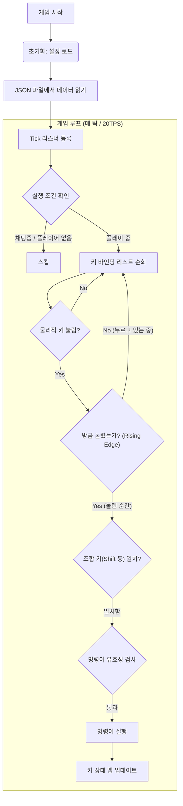
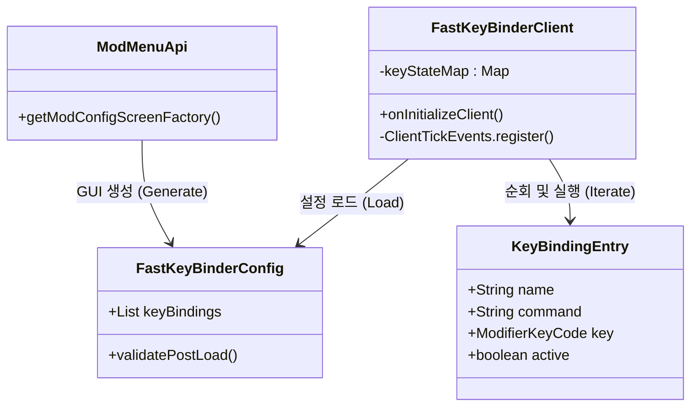

# DMM Fast Key Binder
  

> **[English Manual (영어 매뉴얼)](./README.md)**

## 설명 (Description)
**DMM Fast Key Binder**는 마인크래프트 클라이언트 환경(Fabric 1.21.4)에서 동작하는 **경량화된 키 바인딩 유틸리티**입니다.
복잡한 명령어(예: `/gamemode creative`, `/time set day`)를 자주 입력해야 하는 사용자를 위해, 원하는 키(조합 키 포함)에 명령어를 매핑하여 즉시 실행할 수 있는 기능을 제공합니다.

제 3자 오픈 서버나 싱글 플레이 환경에서 채팅창을 열고 타이핑하는 번거로움을 없애고, **직관적인 GUI**를 통해 손쉽게 매크로를 관리할 수 있습니다.

---

### 주요 기능
- **무제한 커스텀 바인딩**: 이름과 명령어를 제한 없이 등록하고 관리할 수 있습니다.
- **복합 키 지원 (Modifiers)**: Shift + F, Ctrl + Alt + R 등 다양한 조합 키를 지원하여 기존 키와 겹치지 않게 설정 가능합니다.
- **편리한 GUI**: Mod Menu와 Cloth Config를 통해 게임 내에서 설정을 직관적으로 변경합니다.
- **스팸 방지 (Rising Edge)**: 키를 꾹 누르고 있어도 명령어가 한 번만 실행되도록 설계되었습니다.
- **스마트 입력 보정**: 명령어 입력 시 앞의 /를 붙이거나 떼어도 자동으로 인식하여 올바르게 실행합니다.

---

### 시스템 구조 (Architecture)

시스템 로직 흐름도 및 구조 보기 (클릭하여 펼치기)

#### 1. 로직 흐름도 (Flowchart)
Spring의 스케줄러처럼 게임의 매 틱(0.05초)마다 입력을 감지하고 처리하는 과정입니다.

#### 2. 클래스 구조 (Class Diagram)

---

### 개발 가이드 (For Backend Devs)

이 모드는 백엔드 개발자에게 친숙한 구조로 설계되었습니다.

| 모드 용어 (Fabric) | 대응 개념 (Spring/Web) | 설명 |
| :--- | :--- | :--- |
| **ClientModInitializer** | @PostConstruct | 클라이언트 실행 시 최초 1회 실행되는 진입점 (Entrypoint) |
| **ConfigData** | @Entity / DTO | JSON 설정 파일과 매핑되는 데이터 객체 (ORM 역할) |
| **ClientTickEvent** | @Scheduled | 게임 루프(Main Loop)에 훅을 걸어 매 틱마다 실행되는 로직 |
| **ModifierKeyCode** | Composite Key | 키 코드와 수정자(Shift/Ctrl/Alt)를 묶어서 관리하는 값 객체(VO) |

---

### 빌드 및 설치 방법
- Release에서 JAR파일만 다운로드 받으신 분들은 .minecraft/mods 파일내부에 4번 필수 모드들과 함께 넣어주시길 바랍니다.
- 반드시 Fabric 환경에서 적용하셔야 합니다.

1. **빌드 (Build)**
   - 터미널에서 ./gradlew build 실행 (또는 IntelliJ Gradle 탭에서 build 태스크 실행)
   
2. **파일 확인**
   - build/libs/ 폴더 내의 DMM_FastKeyBinder-xxx.jar 파일 확인
   - *주의: sources 또는 dev가 붙은 파일은 배포용이 아닙니다.*

3. **설치 (Install)**
   - 마인크래프트 설치 경로의 mods 폴더에 .jar 파일을 복사합니다.

4. **필수 의존성 (Dependencies)**
   - <Strong style="color:tomato">다음 모드들이 함께 설치되어 있어야 정상 작동합니다</Strong>
     - [Fabric API](https://modrinth.com/mod/fabric-api) [1.21.4] Fabric API 0.119.4+1.21.4
     - [Cloth Config API](https://modrinth.com/mod/cloth-config) [Fabric 1.21.4] v17.0.142
     - [Mod Menu](https://modrinth.com/mod/modmenu) v13.0.2 for 1.21.4

### 배포 편의성 개선안

-  스크립트를 활용하는 자동 모드 다운로드 구현
